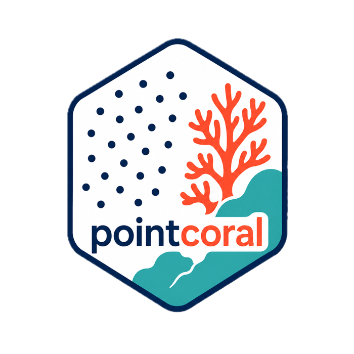
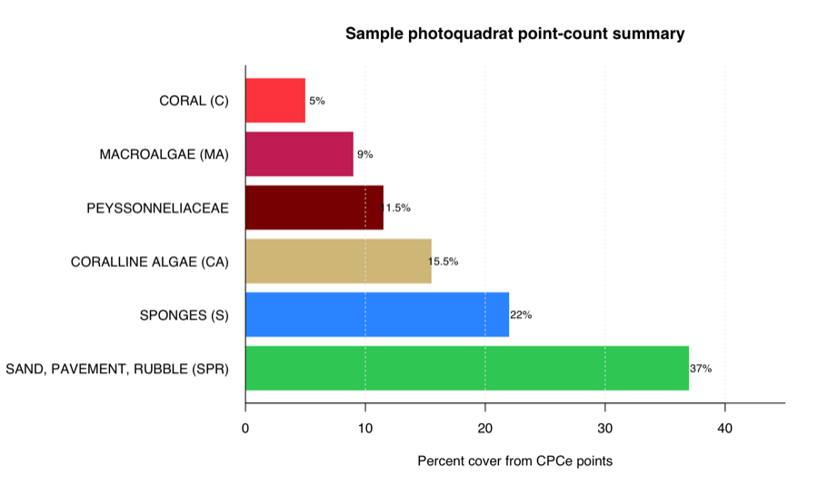
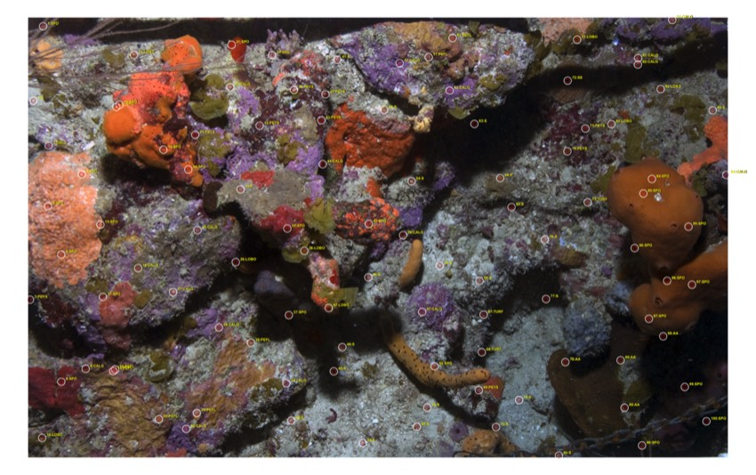
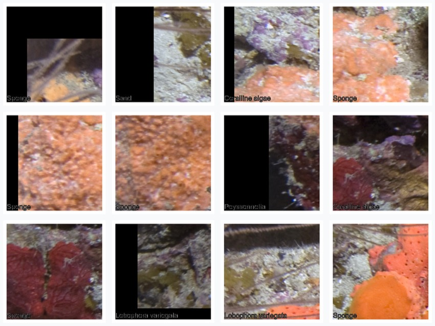
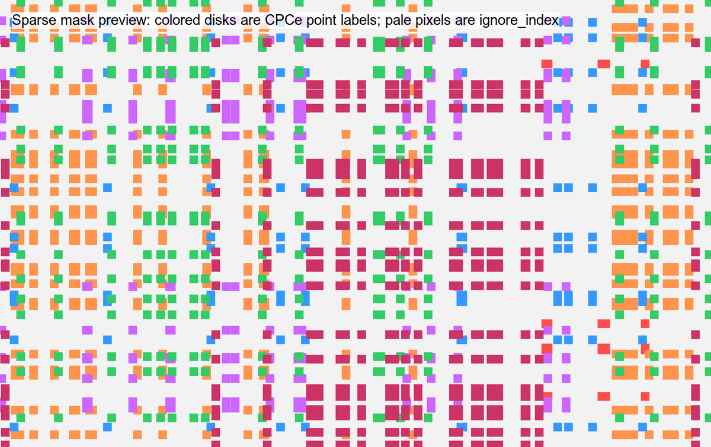

# pointcoral

<p align="center">
  
</p>

`pointcoral` is a local, open-source R package for CPCe/photoquadrat
point-count workflows. It imports CPCe point annotations, matches those points
to source images, creates ecological percent-cover tables, writes visual QC
overlays, and exports
machine-learning-ready point labels, image-centered patches, sparse masks, and
train/validation/test splits. When you want richer labels, it can also
standardize raw short labels with a flexible crosswalk.

The package is designed for reef photoquadrat projects where the raw CPCe labels
are project-specific shorthand codes such as `SPO`, `CALG`, `PEYS`, `LOBO`, or
`S`. Those raw labels are already inside the `.cpc` files and are always
preserved. You can run a bare workflow directly from those labels. A crosswalk
is the optional bonus layer that maps them to full species or benthic type
labels such as `Sponge`, `Coralline algae`, `Peyssonnelia`,
`Lobophora variegata`, or `Sand`, plus the ecological major classes and
subclasses used for analysis.

`pointcoral` does **not** depend on MERMAID, `mermaidr`, CoralNet accounts,
cloud APIs, Python, or any closed platform. It is built to run fully on your own
computer with your own files.

## What this looks like

The package starts with CPCe files and reef images, then produces clean tables,
summary graphics, QC images, and ML-ready outputs. The examples below are built
from the two bundled sample `.cpc` files and matching sample images included in
this repository.

### 1. Optional standardization turns raw CPCe labels into readable labels

CPCe stores short codes. `pointcoral` keeps those short codes but joins them to
the full label and ecological class you define in a crosswalk when you provide
one.

| Raw CPCe label | Full label | Subclass | Major class | Class ID |
|---|---|---|---|---:|
| `SPO` | Sponge | subcategory | SPONGES (S) | 2 |
| `CALG` | Coralline algae | subcategory | CORALLINE ALGAE (CA) | 7 |
| `PEYS` | Peyssonnelia | subcategory | PEYSSONNELIACEAE | 5 |
| `PEFL` | Peyssonnelia flavescens | subcategory | PEYSSONNELIACEAE | 5 |
| `LOBO` | Lobophora variegata | subcategory | MACROALGAE (MA) | 4 |
| `S` | Sand | subcategory | SAND, PAVEMENT, RUBBLE (SPR) | 8 |
| `P` | Pavement | subcategory | SAND, PAVEMENT, RUBBLE (SPR) | 8 |
| `AA` | Agaricia | subcategory | CORAL (C) | 0 |
| `SS` | Siderastrea siderea | subcategory | CORAL (C) | 0 |

### 2. Imported points become a tidy table

Each CPCe point is converted into a row with image identity, pixel coordinates,
and the original raw label. After the optional crosswalk step, the same table
also includes full labels, ecological classes, and class IDs.

| Image | Point | x | y | Raw | Full label | Major class | Class ID |
|---|---:|---:|---:|---|---|---|---:|
| HIW_158_W_U-1 | 1 | 65 | 38 | `SPO` | Sponge | SPONGES (S) | 2 |
| HIW_158_W_U-1 | 2 | 23 | 362 | `S` | Sand | SAND, PAVEMENT, RUBBLE (SPR) | 8 |
| HIW_158_W_U-1 | 3 | 89 | 557 | `CALG` | Coralline algae | CORALLINE ALGAE (CA) | 7 |
| HIW_158_W_U-1 | 4 | 233 | 682 | `SPO` | Sponge | SPONGES (S) | 2 |
| HIW_158_W_U-1 | 7 | 8 | 1226 | `PEYS` | Peyssonnelia | PEYSSONNELIACEAE | 5 |
| HIW_158_W_U-1 | 10 | 61 | 1827 | `LOBO` | Lobophora variegata | MACROALGAE (MA) | 4 |

### 3. Percent-cover summaries are created automatically

This figure summarizes the two bundled sample images after applying the bundled
example crosswalk. The numbers are still computed directly from CPCe point
counts. Without a crosswalk, the same summary functions report percent cover by
`raw_label`.



The same results are also written as CSV tables. For example, image-level output
looks like this:

| Site | Image | Major class | Points | Total points | Percent |
|---|---|---|---:|---:|---:|
| Hole in the Wall | HIW_158_W_U-1 | CORAL (C) | 5 | 100 | 5 |
| Hole in the Wall | HIW_158_W_U-1 | CORALLINE ALGAE (CA) | 18 | 100 | 18 |
| Hole in the Wall | HIW_158_W_U-1 | MACROALGAE (MA) | 11 | 100 | 11 |
| Hole in the Wall | HIW_158_W_U-1 | PEYSSONNELIACEAE | 16 | 100 | 16 |
| Hole in the Wall | HIW_158_W_U-1 | SAND, PAVEMENT, RUBBLE (SPR) | 23 | 100 | 23 |
| Hole in the Wall | HIW_158_W_U-1 | SPONGES (S) | 27 | 100 | 27 |

### 4. QC overlays show whether points landed in the right place

The package writes annotated images so you can inspect CPCe point placement and
labels before trusting summaries or ML exports.



### 5. ML patch datasets can be made from the same points

Each point can become an image-centered crop. These patches can be used for
patch classification, active learning, review workflows, or as weak labels for
model development.



### 6. Sparse masks are weak segmentation labels

Sparse masks only label a small disk around each CPCe point. The pale background
is `ignore_index`, meaning it is not treated as a dense annotation.



## Installation

Install from GitHub:

```r
install.packages("remotes")
remotes::install_github("el-cordero/pointcoral")
```

Load the package:

```r
library(pointcoral)
```

## RStudio testing folder

If you are working from the local `PointCoralPackage` folder, there is a
ready-to-use RStudio helper folder outside the package directory:

```text
PointCoralPackage/
  pointcoral/
  pointcoral-rstudio-workflows/
```

Open `pointcoral-rstudio-workflows/` in RStudio and run:

1. `00_build_install_pointcoral.R`
2. `01_run_sample_data.R`
3. `pointcoral_rstudio_walkthrough.Rmd`
4. Copy `02_run_my_data_template.R` and edit the paths for your own data.

The same helper files are mirrored in `rstudio-workflows/` in this GitHub repo
so they stay synced, but that folder is excluded from R package builds.

## What pointcoral expects

At minimum you need:

1. CPCe `.cpc` files or CPCe-like point export tables.
2. Matching image files.

A simple project folder can look like this:

```text
my_project/
  cpce/
    HIW_158_W_U-1.cpc
    H_211_E_U-1.cpc
  images/
    HIW_158_W_U-1.jpg
    H_211_E_U-1.jpg
  outputs/
```

The `.cpc` files and images may also live in the same folder. Image matching is
by basename, so `HIW_158_W_U-1.cpc` matches `HIW_158_W_U-1.jpg`.

A crosswalk is optional. Add one when you want to translate raw CPCe labels into
full labels, major ecological classes, subclasses, or project-specific ML
classes:

```text
my_project/
  labels/
    my_crosswalk.csv
```

## Important label model

The package uses this distinction:

- `raw_code`: the original CPCe short code.
- `raw_label`: also the original CPCe short code as it appeared in the `.cpc`.
- `full_label`: the full species or benthic type name. This usually comes from
  a crosswalk, not from the bare `.cpc` point rows.
- `clean_label`: the standardized analysis label. By default this is the same
  as `full_label`.
- `label_class`: the subclass/type vocabulary from the inspected
  `clean_transect_raw.py` workflow, such as `subcategory`, `artifact`, or
  `disease_or_condition`.
- `major_category`: the ecological major class, such as `CORAL (C)`,
  `SPONGES (S)`, `PEYSSONNELIACEAE`, or
  `SAND, PAVEMENT, RUBBLE (SPR)`.
- `ml_class`: the class label used for ML exports after standardization. In a
  bare workflow, `pointcoral` uses `raw_label` instead.
- `class_id`: integer ID for ML masks and class lookup tables. If a crosswalk
  does not provide IDs, IDs are generated from the label column being used.

For example:

```text
raw_code raw_label full_label                label_class major_category
SPO      SPO       Sponge                    subcategory SPONGES (S)
CALG     CALG      Coralline algae           subcategory CORALLINE ALGAE (CA)
PEFL     PEFL      Peyssonnelia flavescens   subcategory PEYSSONNELIACEAE
LOBO     LOBO      Lobophora variegata       subcategory MACROALGAE (MA)
S        S         Sand                      subcategory SAND, PAVEMENT, RUBBLE (SPR)
```

The bundled example crosswalk was generated from the existing scripts and uses
the major-class/subclass vocabulary in `_existing/clean_transect_raw.py`. It is
a starting example, not a universal ontology. You do not need it for the bare
workflow, but you should review it against your own CPCe codefile before using
standardized classes for final analysis.

## Quick start with bundled example data

The package includes two small `.cpc` files and matching JPEGs in `inst/extdata`.

```r
library(pointcoral)
library(dplyr)

example_dir <- system.file("extdata", package = "pointcoral")

points_raw <- read_cpce_folder(
  path = example_dir,
  image_root = example_dir,
  recursive = FALSE
)

points_raw |>
  select(image_id, point_id, x_px, y_px, raw_label) |>
  head()
```

Bare example output:

```text
image_id       point_id x_px y_px raw_label
HIW_158_W_U-1 1        65   38    SPO
HIW_158_W_U-1 2        23   362   S
HIW_158_W_U-1 3        89   557   CALG
```

You can summarize immediately by raw CPCe label:

```r
summarize_images(points_raw)
```

Then, as an optional standardization step, add the example crosswalk:

```r
crosswalk_path <- system.file(
  "extdata",
  "pointcoral_example_crosswalk.csv",
  package = "pointcoral"
)

crosswalk <- read_label_crosswalk(crosswalk_path)
points_clean <- standardize_labels(points_raw, crosswalk)
points_clean |>
  select(image_id, point_id, x_px, y_px, raw_label, full_label,
         label_class, major_category, class_id) |>
  head()
```

Example output columns:

```text
image_id       point_id x_px y_px raw_label full_label       major_category
HIW_158_W_U-1 1        65   38    SPO       Sponge           SPONGES (S)
HIW_158_W_U-1 2        23   362   S         Sand             SAND, PAVEMENT, RUBBLE (SPR)
HIW_158_W_U-1 3        89   557   CALG      Coralline algae  CORALLINE ALGAE (CA)
```

## One-command workflow

Use `run_pointcoral()` when your goal is to import a folder, write ecological
tables, create ML labels, and optionally write patches, sparse masks, and QC
overlays. The bare call does not need a crosswalk:

```r
out_dir <- file.path(tempdir(), "pointcoral_outputs")

result <- run_pointcoral(
  cpce_dir = example_dir,
  image_root = example_dir,
  out_dir = out_dir,
  recursive = FALSE,
  patch_size = 224,
  make_patches = FALSE,
  make_masks = TRUE,
  make_qc = TRUE
)

result$validation_report
result$class_col
result$ml_points
```

When you want full labels and major classes, pass a crosswalk:

```r
result_standardized <- run_pointcoral(
  cpce_dir = example_dir,
  image_root = example_dir,
  out_dir = file.path(tempdir(), "pointcoral_outputs_standardized"),
  crosswalk_path = crosswalk_path,
  recursive = FALSE,
  class_col = "ml_class",
  make_patches = FALSE,
  make_masks = TRUE,
  make_qc = TRUE
)

result_standardized$crosswalk_check
result_standardized$points_clean |>
  select(raw_label, full_label, major_category, class_id) |>
  head()
```

The output folder contains:

```text
outputs/
  tables/
    points_raw.csv
    points_clean.csv
    image_summary.csv
    transect_summary.csv
    site_summary.csv
    class_lookup.csv
    validation_report.csv
    crosswalk_check.csv
  ml/
    labels.csv
    labels_train.csv
    labels_val.csv
    labels_test.csv
    class_lookup.csv
  patches/
    train/
    val/
    test/
  sparse_masks/
    masks/
    manifest.csv
  qc/
    overlays/
    label_summary.csv
```

## Step-by-step workflow

### 1. Read one CPCe file

```r
cpc_file <- system.file("extdata", "HIW_158_W_U-1.cpc", package = "pointcoral")

points <- read_cpce_file(cpc_file)

nrow(points)
names(points)
```

`read_cpce_file()` currently parses the text `.cpc` structure used by the
sample files and original scripts:

1. Header row with CPCe codefile path and image path.
2. Four ROI vertex rows.
3. Point count row.
4. Point coordinate rows.
5. Point label rows.

The parser is tested against the sample `.cpc` files in this repository. Do not
assume every possible CPCe export variant is supported until you test it with
your own files.

### 2. Read a folder

```r
points <- read_cpce_folder(
  path = "my_project/cpce",
  image_root = "my_project/images",
  recursive = TRUE
)
```

`read_cpce_folder()` reads `.cpc` files and attempts to read point-like
CSV/TSV/XLS/XLSX exports. It skips obvious crosswalk/lookup files so an
`extdata` or project folder can contain both data and a crosswalk.

### 3. Match images

```r
points <- match_images(points, image_root = "my_project/images")
```

This fills:

- `image_path`
- `image_width`
- `image_height`
- `x_px`
- `y_px`

If CPCe coordinates are in a different coordinate space than the actual image,
the conversion is proportional:

```r
converted <- convert_cpce_coords(
  points = tibble::tibble(cpce_x = 50, cpce_y = 25),
  cpce_width = 100,
  cpce_height = 50,
  image_width = 1000,
  image_height = 500
)
```

The original CPCe coordinates remain in `cpce_x` and `cpce_y`.

### 4. Use the labels already in the CPCe files

The bare workflow starts here. The `.cpc` point rows already contain labels, so
you can validate, summarize, split, export ML labels, and write QC overlays
without a crosswalk.

```r
validate_points(points)

summarize_images(points)
summarize_transects(points)
summarize_sites(points)

points_split <- split_ml_points(points, split_by = "image", seed = 1)
ml_points <- make_ml_points(points_split)
```

When `major_category` or `ml_class` are empty, these functions automatically use
`raw_label`. Generated class IDs are assigned from the raw labels for ML CSVs
and sparse masks.

### 5. Optional: read and inspect a crosswalk

```r
xwalk <- read_label_crosswalk("my_project/labels/my_crosswalk.csv")

glimpse(xwalk)
```

Recommended crosswalk columns:

```text
raw_code
raw_label
full_label
clean_label
label_class
major_category
ml_class
class_id
include_in_analysis
include_in_ml
notes
```

The reader also recognizes common synonyms from older scripts, including
`label_clean`, `major_class`, and `keep`.

### 6. Optional: check the crosswalk before joining

```r
report <- check_crosswalk(points, xwalk)
report
```

This reports:

- raw labels present in CPCe data but missing from the crosswalk
- crosswalk labels not present in the current data
- duplicate mappings
- missing class IDs
- classes marked for exclusion

### 7. Optional: standardize labels

```r
points_clean <- standardize_labels(
  points,
  xwalk,
  by = "raw_code",
  unknown_action = "warn"
)
```

Unknown-label behavior is explicit:

```r
standardize_labels(points, xwalk, unknown_action = "warn")  # warn and keep
standardize_labels(points, xwalk, unknown_action = "keep")  # keep silently
standardize_labels(points, xwalk, unknown_action = "drop")  # warn and drop
standardize_labels(points, xwalk, unknown_action = "error") # stop
```

The package never silently drops unmapped labels.

### 8. Validate standardized points

```r
validate_points(points_clean)
```

Checks include:

- required fields
- missing raw labels
- missing coordinates
- duplicated point IDs within images
- coordinates outside image bounds
- missing image files
- missing image dimensions

### 9. Summarize standardized ecological cover

Summarize by major class:

```r
summarize_images(points_clean, class_col = "major_category")
summarize_transects(points_clean, class_col = "major_category")
summarize_sites(points_clean, class_col = "major_category")
```

Summarize by full species/type:

```r
summarize_images(points_clean, class_col = "clean_label")
```

Summarize by raw CPCe code:

```r
summarize_images(points_clean, class_col = "raw_label")
```

Use custom grouping:

```r
summarize_points(
  points_clean,
  by = c("site", "transect", "survey_date"),
  class_col = "major_category"
)
```

Write summary tables:

```r
write_summary_tables(
  points_clean,
  out_dir = "my_project/outputs/tables",
  class_cols = c("major_category", "clean_label", "ml_class")
)
```

## Machine-learning examples

### Make ML point labels

Bare CPCe labels:

```r
ml_points <- make_ml_points(points_split)
```

Standardized labels after a crosswalk:

```r
ml_points <- make_ml_points(points_clean, class_col = "ml_class")

ml_points |>
  select(image_path, image_id, x_px, y_px, label, class_id, split,
         raw_label, full_label, major_category) |>
  head()
```

### Split without leakage

Split by image:

```r
points_split <- split_ml_points(
  points_clean,
  split_by = "image",
  train = 0.70,
  val = 0.15,
  test = 0.15,
  seed = 1
)
```

Split by transect:

```r
points_split <- split_ml_points(points_clean, split_by = "transect", seed = 1)
```

Split by site:

```r
points_split <- split_ml_points(points_clean, split_by = "site", seed = 1)
```

Write ML CSV files:

```r
ml_points <- make_ml_points(points_split)
write_ml_points_csv(ml_points, out_dir = "my_project/outputs/ml")
```

### Extract point-centered patches

```r
patch_manifest <- extract_point_patches(
  points_split,
  image_root = "my_project/images",
  out_dir = "my_project/outputs/patches",
  patch_size = 224,
  edge = "skip"
)
```

Use `edge = "pad"` to keep points near image borders:

```r
patch_manifest <- extract_point_patches(
  points_split,
  image_root = "my_project/images",
  out_dir = "my_project/outputs/patches_padded",
  patch_size = 224,
  edge = "pad"
)
```

Patch outputs are organized by split and class:

```text
patches/
  train/
    CORAL_C/
    SPONGES_S/
  val/
  test/
  patch_manifest.csv
```

### Create sparse masks

```r
mask_manifest <- make_sparse_masks(
  points_split,
  image_root = "my_project/images",
  out_dir = "my_project/outputs/sparse_masks",
  radius = 3,
  ignore_index = 255,
  background_index = 0
)
```

Sparse masks are weak labels. Only small disks around CPCe points contain class
IDs. All unlabeled pixels are `ignore_index` by default. These are not dense
human-annotated segmentation masks.

### Export helper formats

Local CoralNet-style point CSV:

```r
export_coralnet_points(points_clean, out_dir = "my_project/outputs/coralnet")
```

YOLO-style classification patches:

```r
export_yolo_classification(
  points_split,
  image_root = "my_project/images",
  out_dir = "my_project/outputs/yolo_patches",
  patch_size = 224
)
```

SegFormer-style sparse masks:

```r
export_segformer_sparse(
  points_split,
  image_root = "my_project/images",
  out_dir = "my_project/outputs/segformer_sparse",
  radius = 3
)
```

## QC examples

### Overlay points on one image

```r
one_image <- unique(points_clean$image_path)[1]
one_points <- points_clean[points_clean$image_path == one_image, ]

overlay <- plot_points_on_image(
  image_path = one_image,
  points = one_points,
  point_size = 8
)

overlay
```

### Write overlays for all images

```r
overlay_manifest <- write_qc_overlays(
  points_clean,
  image_root = "my_project/images",
  out_dir = "my_project/outputs/qc"
)
```

Try different label columns:

```r
write_qc_overlays(points_clean, "my_project/images", "qc_raw", label_col = "raw_label")
write_qc_overlays(points_clean, "my_project/images", "qc_major", label_col = "major_category")
write_qc_overlays(points_clean, "my_project/images", "qc_ml", label_col = "ml_class")
```

### Label QC summary

```r
qc_label_summary(points_clean, label_col = "ml_class")
```

This helps identify unmapped labels, rare classes, duplicate points, and class
balance.

## Custom crosswalk examples

A minimal crosswalk can join on raw labels only:

```r
my_xwalk <- tibble::tribble(
  ~raw_label, ~full_label, ~clean_label, ~label_class, ~major_category, ~ml_class, ~class_id,
  "SPO", "Sponge", "Sponge", "subcategory", "SPONGES (S)", "SPONGES (S)", 2,
  "S", "Sand", "Sand", "subcategory", "SAND, PAVEMENT, RUBBLE (SPR)", "SAND, PAVEMENT, RUBBLE (SPR)", 8,
  "CALG", "Coralline algae", "Coralline algae", "subcategory", "CORALLINE ALGAE (CA)", "CORALLINE ALGAE (CA)", 7
)

points_clean <- standardize_labels(points, my_xwalk, by = "raw_label")
```

You can also join on different column names:

```r
my_xwalk <- tibble::tribble(
  ~cpce_code, ~species_or_type, ~major_class,
  "SPO", "Sponge", "SPONGES (S)",
  "S", "Sand", "SAND, PAVEMENT, RUBBLE (SPR)"
)

my_xwalk <- read_label_crosswalk("my_crosswalk.csv")

points_clean <- standardize_labels(
  points,
  my_xwalk,
  by = c(raw_code = "raw_code")
)
```

Use a different ML class scheme from your ecological scheme:

```r
xwalk <- read_label_crosswalk("my_project/labels/my_crosswalk.csv")

xwalk$ml_class <- dplyr::case_when(
  xwalk$major_category == "CORAL (C)" ~ "live_coral",
  xwalk$major_category %in% c("SPONGES (S)", "GORGONIANS (G)", "ZOANTHIDS (Z)") ~ "other_live",
  xwalk$major_category == "SAND, PAVEMENT, RUBBLE (SPR)" ~ "substrate",
  TRUE ~ "other"
)

xwalk$class_id <- match(xwalk$ml_class, sort(unique(xwalk$ml_class))) - 1L
points_clean <- standardize_labels(points, xwalk)
```

## Input formats

Tested now:

- CPCe `.cpc` files matching the bundled sample structure.
- JPEG images matching `.cpc` basenames.
- CSV/Excel crosswalk files.
- Generic point-like CSV/TSV/XLS/XLSX exports with recognizable coordinate and
  label columns.

Inspected from the original scripts but not claimed as fully tested yet:

- Project-specific CPCe Excel "Data Summary" workbooks from
  `_existing/clean_transect_raw.py`.
- Permanent transect workbook layouts from the original external data folders.
- Dense prediction CSV expansion for pseudo-mask growth.
- Full image/mask tiling for SegFormer training.

Those workflows need representative fixture files before the package should
claim full support.

## Core tidy point table

Where available, pointcoral returns:

```text
project_id
site
transect
survey_date
image_id
image_file
image_path
point_id
cpce_x
cpce_y
cpce_width
cpce_height
image_width
image_height
x_px
y_px
raw_code
raw_label
full_label
clean_label
label_class
major_category
ml_class
class_id
reviewer
notes
```

Extra source columns are preserved.

## Troubleshooting

### My `.cpc` file imports but image paths are missing

Use `match_images()` with the folder containing your real local images:

```r
points <- match_images(points, image_root = "path/to/images")
```

CPCe files often contain old Windows image paths. pointcoral uses basename
matching so local macOS/Linux paths can still work.

### My coordinates look shifted

Write QC overlays:

```r
write_qc_overlays(points_clean, image_root = "images", out_dir = "qc")
```

The current tested conversion is proportional scaling from CPCe ROI coordinate
space to image pixels. If your project used a different CPCe geometry
configuration, inspect overlays before trusting summaries or ML exports.

### Some labels are unmapped

Run:

```r
check_crosswalk(points, xwalk)
```

Then add the missing `raw_label`/`raw_code` rows to your crosswalk. Do not use
the bundled example blindly for final ecological analysis.

### I only want ecological tables, not ML outputs

Use the lower-level functions:

```r
points <- read_cpce_folder("cpce", image_root = "images")
xwalk <- read_label_crosswalk("crosswalk.csv")
points_clean <- standardize_labels(points, xwalk)
write_summary_tables(points_clean, out_dir = "outputs/tables")
```

### I only want ML labels and patches, not ecological summaries

```r
points <- read_cpce_folder("cpce", image_root = "images")
xwalk <- read_label_crosswalk("crosswalk.csv")
points_clean <- standardize_labels(points, xwalk)
points_split <- split_ml_points(points_clean, split_by = "image")
ml_points <- make_ml_points(points_split, class_col = "ml_class")
write_ml_points_csv(ml_points, "outputs/ml")
extract_point_patches(points_split, "images", "outputs/patches")
```

## Development notes

Original scripts are preserved in `_existing/`. The package refactors tested
logic into small R functions and documents ambiguous parts in
`dev-notes/workflow_inventory.md`.

The package author/maintainer is Elvin Cordero
<elvin.cordero@seamountgeo.com>.
